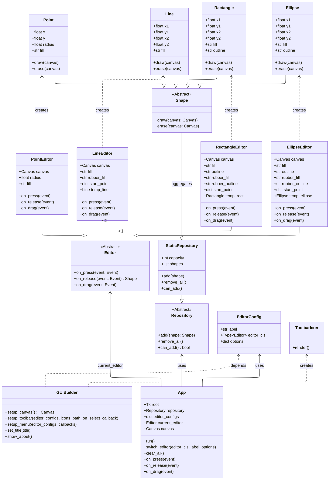

```mermaid
---
config:
  layout: elk
---
classDiagram
direction BT
    class Shape {
	    +draw(canvas: Canvas)
	    +erase(canvas: Canvas)
    }
    class Editor {
	    +on_press(event: Event)
	    +on_release(event: Event) Shape
	    +on_drag(event: Event)
    }
    class Repository {
	    +add(shape: Shape)
	    +remove_all()
	    +can_add() bool
    }
    class Point {
	    +float x
	    +float y
	    +float radius
	    +str fill
	    +draw(canvas)
	    +erase(canvas)
    }
    class Line {
	    +float x1
	    +float y1
	    +float x2
	    +float y2
	    +str fill
	    +draw(canvas)
	    +erase(canvas)
    }
    class Ractangle {
	    +float x1
	    +float y1
	    +float x2
	    +float y2
	    +str fill
	    +str outline
	    +draw(canvas)
	    +erase(canvas)
    }
    class Ellipse {
	    +float x1
	    +float y1
	    +float x2
	    +float y2
	    +str fill
	    +str outline
	    +draw(canvas)
	    +erase(canvas)
    }
    class PointEditor {
	    +Canvas canvas
	    +float radius
	    +str fill
	    +on_press(event)
	    +on_release(event)
	    +on_drag(event)
    }
    class LineEditor {
	    +Canvas canvas
	    +str fill
	    +str rubber_fill
	    +dict start_point
	    +Line temp_line
	    +on_press(event)
	    +on_release(event)
	    +on_drag(event)
    }
    class RectangleEditor {
	    +Canvas canvas
	    +str fill
	    +str outline
	    +str rubber_fill
	    +str rubber_outline
	    +dict start_point
	    +Ractangle temp_rect
	    +on_press(event)
	    +on_release(event)
	    +on_drag(event)
    }
    class EllipseEditor {
	    +Canvas canvas
	    +str fill
	    +str outline
	    +str rubber_fill
	    +str rubber_outline
	    +dict start_point
	    +Ellipse temp_ellipse
	    +on_press(event)
	    +on_release(event)
	    +on_drag(event)
    }
    class StaticRepository {
	    +int capacity
	    +list shapes
	    +add(shape)
	    +remove_all()
	    +can_add()
    }
    class EditorConfig {
	    +str label
	    +Type~Editor~ editor_cls
	    +dict options
    }
	class ToolbarIcon {
		+render()
	}
	class GUIBuilder {
		+setup_canvas(): Canvas
		+setup_toolbar(editor_configs, icons_path, on_select_callback)
		+setup_menu(editor_configs, callbacks)
		+set_title(title)
		+show_about()
	}
    class App {
	    +Tk root
	    +Repository repository
	    +dict editor_configs
	    +Editor current_editor
	    +Canvas canvas
	    +run()
		+switch_editor(editor_cls, label, options)
	    +clear_all()
	    +on_press(event)
	    +on_release(event)
	    +on_drag(event)
    }

	<<Abstract>> Shape
	<<Abstract>> Editor
	<<Abstract>> Repository

    Shape <|-- Point
    Shape <|-- Line
    Shape <|-- Ractangle
    Shape <|-- Ellipse
    Editor <|-- PointEditor
    Editor <|-- LineEditor
    Editor <|-- RectangleEditor
    Editor <|-- EllipseEditor
	GUIBuilder ..> ToolbarIcon : creates
    PointEditor ..> Point : creates
    LineEditor ..> Line : creates
    RectangleEditor ..> Ractangle : creates
    EllipseEditor ..> Ellipse : creates
    Repository <|-- StaticRepository
    StaticRepository o-- Shape : aggregates
    App --> Repository : uses
    App --> Editor : current_editor
    App --> EditorConfig : uses
	GUIBuilder ..> EditorConfig: depends
```
